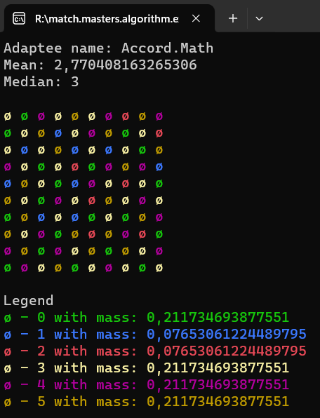

# Overall description
It is created for generating matrix randomly by using two kinds of distributions.
Output is coloured to ensure readiness.
Generation has two modes: strict and happy.
Happy allows to have maximum 2 colours in a row/column, as the strict mode does not allow it.

# Example


# Original game
```
https://www.candivore.io/games/match-masters/
```
# Startup project
```
Executor.csproj
```